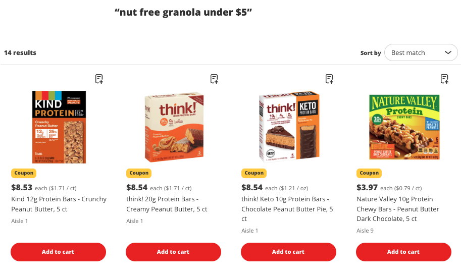
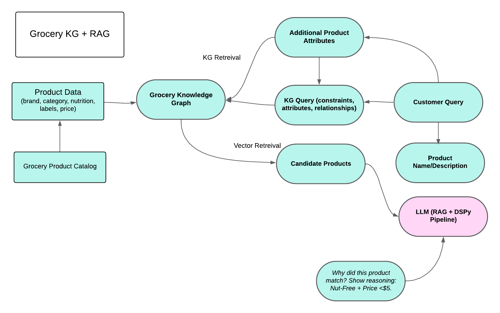

Smarter Grocery Search w/ Knowledge Graph RAG and DSPy

Problem:

In modern grocery retail, customers expect search experiences that are fast, relevant, and personalized. If you search for “nut-free granola under $5”, a typical keyword search fail because it doesn’t understand “nut-free” as an attribute and it might pull any “granola” regardless of price.



This highlights three core challenges:

Multi-attribute complexity
Each product spans multiple structured fields: brand, category, nutrition, ingredients, dietary tags, and price. A single query can touch all of them.

Free-form natural language
Shoppers don’t speak in schemas. They mix attributes (“nut-free”), numeric filters (“under $5”), and categories (“granola”) in ways that don’t align neatly to database fields.

Explainability and trust
Customers want to know why a product is recommended, and merchandisers need to validate how items surface in search. Without transparency, trust erodes.

Traditional keyword or embedding search struggles to consistently deliver relevance in this context. Traditional vector retrieval methods capture semantic similarity but struggle with constraints like price thresholds or categorical attributes. A Knowledge Graph offers a formal representation G=(V,E), where products, brands, and attributes are entities V, and relationships such as HAS_ATTRIBUTE or IN_CATEGORY are edges E. Queries like “nut-free granola under $5” can then be interpreted as subgraph patterns with attribute constraints and a numeric inequality, which classical vector spaces cannot enforce. This motivates a hybrid retriever that fuses: 

Knowledge Graph → Precision, constraints, explainability.

Vector Embeddings → Semantic recall

Solution: Knowledge Graph RAG w/ DSPY:

This architecture generalizes the conventional Retrieval-Augmented Generation (RAG) paradigm. Rather than treating retrieval as a flat vector similarity operation, we augment it with structured graph-based reasoning. The result is a hybrid retriever that balances semantic flexibility with constraint enforcement.

To tackle these challenges, we combine three complementary pieces:

Vector embeddings – capture semantic similarity, so queries like “granola” and “cereal” don’t miss relevant matches.

Knowledge Graphs (KGs) – enforce structured reasoning, letting us filter by attributes (e.g., HAS_ATTRIBUTE = nut-free) and constraints (e.g., PRICE < 5).

DSPy: a framework for declaratively building LLM pipelines, so we can design hybrid retrieval systems that are modular, explainable, and easy to extend.

This approach extends the familiar Retrieval-Augmented Generation (RAG) pattern. Instead of treating retrieval as a flat vector lookup, we enrich it with structured knowledge.

Why Knowledge Graph RAG?

A grocery product is not just a row in a table, it’s better understood as a node in a network of relationships. Take something as simple as granola. It isn’t defined only by its name, it’s linked to a brand, placed within a category such as Pantry → Granola, associated with ingredients like oats or almonds, described by attributes like nut-free or gluten-free, and tied to price metadata that could reflect everyday low price, promotions, or coupon eligibility.

This web of connections is what a Knowledge Graph (KG) captures. In a KG, edges describe meaning: a product HAS_ATTRIBUTE Nut-Free, IN_CATEGORY Granola, or MADE_BY brand. That structure gives us more than just labels, it encodes the logic of how grocery items relate to one another.

Compare that to a Classic RAG pipeline: 

Search → Embedding → Vector DB → Retrieved Docs → LLM answers.

This flow works well when the goal is retrieving unstructured text — FAQs, policy documents, articles. But it breaks down in retail search. Embeddings can tell us that “granola” is semantically similar to “cereal.” What they can’t do reliably is enforce constraints like “must be nut-free,” “price under $5,” or “belongs in the Pantry category.” And those are exactly the rules shoppers care about.

Imagine a customer in Texas searching for “organic salsa under $4.” That query carries intent across multiple structured dimensions at once: a dietary attribute, a category, and a numeric filter. A vector-only search may capture the gist of “salsa,” but it often drops the fine-grained conditions that make the result meaningful.

This is why Knowledge Graph RAG matters. It blends the semantic flexibility of embeddings with the structured precision of graph reasoning. In practice, that means a product like Nut-Free Crunch Granola ($4.79) is represented not just by text embeddings but by explicit graph links to its attributes, category, brand, and price. When retrieved, the system can explain itself:

“Recommended because it’s granola, tagged nut-free, and priced under $5.”

The results create a system tuned for how people actually shop for groceries. combining natural language flexibility with structured, constraint-aware precision.

Enter DSPy

DSPy helps us build this LLM pipeline declaratively. Designing hybrid retrieval pipelines with LLMs often turns into a mess of brittle prompt chains and glue code. That’s where DSPy comes in. Instead of hand-crafting prompts, DSPy lets you declare what the pipeline should do, and it handles the rest.

The building blocks are simple:

Signatures: define inputs/outputs (e.g. ProductSearchSignature).

Modules: compose retrieval + answer steps.

Programs: orchestrate hybrid retrieval + answer generation.

For example, a product search task can be expressed in just a few lines:

```python
import dspy

class ProductSearchSignature(dspy.Signature):
    """Return product suggestions and key facts based on a grocery search query."""
    query: str
    hybrid_context: list[str]
    suggestions: str
```

With this declaration, DSPy automatically generates the right prompts behind the scenes. That means pipelines stay modular, explainable, and easier to maintain. You focus on what needs to happen (semantic + graph retrieval, ranking, explanation), not on how to hack together prompts.

In practice, this makes DSPy a natural fit for Knowledge Graph RAG in grocery search, where transparency and structured reasoning are just as important as semantic recall.

Architecture:

The architecture integrates structured reasoning from a Knowledge Graph (KG) with semantic recall from vector retrieval, orchestrated through a declarative DSPy pipeline. Product data from the grocery catalog (brand, category, nutrition, labels, and price) is ingested into the KG, where it is linked to attributes and relationships such as HAS_ATTRIBUTE or IN_CATEGORY. At query time, a customer request is decomposed into both free-text (e.g., product names or descriptions) and structured constraints (e.g., nut-free, price < $5). The KG enforces attribute and numeric filters, while embeddings capture broader semantic matches. Candidate products retrieved from both channels are passed to the LLM layer, where DSPy coordinates hybrid reasoning and explanation. This final stage produces not only ranked recommendations but also explicit justifications (e.g., “recommended because it is granola, tagged nut-free, and priced under $5”), ensuring transparency and trust in the system.



Sample grocery dataset:

```
product_id,name,brand,category,sub_category,price,ingredients,attributes
1,Oats & Honey Granola,Pantry,Cereal & Granola,4.49,"Whole grain oats,honey,almonds","contains_nuts;vegetarian"
2,Central Market Organic Granola Low Sugar,Central Market,Pantry,Cereal & Granola,5.99,"Oats,coconut,chia,monk fruit","organic;low_sugar;vegan"
...
```

Vector Store (FAISS + Embeddings):

Dense vector representations form the backbone of modern search. They map products and queries into a shared continuous space where similarity is measured by cosine distance or inner product. Historically, models like Word2Vec and GloVe used 200–300 dimensions; transformers like BERT/SBERT expanded this to ~768; and today’s API embeddings often run 1,536–4,096 dimensions. Benchmarks like MTEB show higher dimensions improve recall and coverage, but at the cost of speed, memory, and storage.

For grocery search, embeddings help generalize semantically (“granola” ≈ “cereal”) and capture brand or description similarity. But dimensionality alone cannot enforce structured rules like HAS_ATTRIBUTE = nut_free or PRICE < 5. This is why we need a hybrid approach: embeddings for semantic recall, knowledge graphs for constraints and explainability.

We use SentenceTransformers + FAISS to encode product text (name, brand, category, attributes, nutrition).

```python
from sentence_transformers import SentenceTransformer
import faiss

model = SentenceTransformer("all-MiniLM-L6-v2")
embs = model.encode(product_texts, normalize_embeddings=True)
index = faiss.IndexFlatIP(embs.shape[1])
index.add(embs.astype("float32"))
```

Knowledge Graph Representation:

We also ingest the dataset into a KG for explicit reasoning:

```python
import networkx as nx

G = nx.Graph()
for _, r in df.iterrows():
    pid = f"product:{r.product_id}"
    G.add_node(pid, label="Product", name=r.name, brand=r.brand)
    # Link to category + attributes
    G.add_node(f"attr:{r.attributes}", label="Attribute")
    G.add_edge(pid, f"attr:{r.attributes}", type="HAS_ATTRIBUTE")
```

This allows us to query structured relationships.

Hybrid Retrieval

To combine both sources of relevance:

Perform vector search for semantic candidates.

Expand candidates using KG neighbors (attributes, categories, ingredients).

Merge into a hybrid context.

```python
vec_results = vector_search(query, k=6)
kg_results = kg_search(query, k=6)

context_texts = [r["text"] for r in vec_results + kg_results]
```

The LLM now sees semantic hits + structured facts.

DSPy Pipeline:

We define DSPy for search & answering:

```python
class ProductSearchSignature(dspy.Signature):
    query: str
    hybrid_context: list[str]
    suggestions: str

class HybridSearchProgram(dspy.Module):
    def __init__(self):
        self.search_llm = dspy.Predict(ProductSearchSignature)

    def forward(self, query: str):
        vec = vector_search(query)
        kg = kg_search(query)
        context = [r["text"] for r in vec + kg]
        pred = self.search_llm(query=query, hybrid_context=context)
        return pred.suggestions
```

HybridSearchProgram merges vector + KG retrieval.

DSPy generates prompts under the hood, ensuring modularity and transparency. DSPy uses the description you defined in your Signature to generate examples into the prompt. 

Walkthrough:

Example 1: “nut-free granola under $5”

Vector Search finds granola products.

KG filters for attribute = nut-free and price < 5.

Result: Nut-Free Crunch Granola ($4.79).

Explainability: Why Did This Product Rank?

One of the biggest pain points in grocery search is that results often feel like a black box. Shoppers see a product surface, but they don’t know why. Did it match a keyword? Was it the cheapest? Or was it just similar text in the description? That’s not good enough when customers are filtering by dietary needs and health attributes. Grocery catalogs are packed with metadata, organic, nut-free, gluten-free, low sodium, high protein, and customers expect search to honor those signals. If a parent is shopping for a child with a nut allergy, they don’t just want “granola.” They want to know it’s nut-free and still within budget.

This is where Knowledge Graph RAG changes the game. Because products are represented as nodes connected to explicit attributes, the system can explain itself:

“Recommended because it’s granola, tagged nut-free, and priced under $5.”

That simple explanation builds trust with shoppers who can see their intent and why certain items surfaced.

Conclusion:

Integrating vector embeddings, knowledge graphs, and DSPy yields a retrieval architecture that aligns with the complexity of modern grocery search. Embeddings provide semantic recall, knowledge graphs enforce attribute and numeric constraints, and DSPy ensures that the pipeline remains modular and declarative. The result is a system that is:

Constraint-aware – results respect attributes and thresholds rather than relying solely on lexical matches.

Explainable – recommendations are transparent and auditable, enabling both shopper trust and merchandiser validation.

Maintainable – the declarative design simplifies extension and long-term support.

For grocery retail, where discovery often hinges on nuanced attributes like organic, nut-free, or low sodium, this hybrid approach unlocks a better discovery. It means customers can find exactly what they need, with confidence, while the retailer delivers on the promise of a more personlized and helpful digital experience And with DSPy, the pipeline stays clean, modular, and transparent.

How to Try It: 

```
Clone the repo (Gitlab link here).

poetry install

poetry shell

poetry run python -m sgs prepare-data → builds KG + FAISS index.

poetry run python -m sgs run-server → starts API.

curl 'http://127.0.0.1:8000/search?q=nut-free%granola'
```

Sources:

RAG: https://neo4j.com/blog/developer/rag-tutorial/​

DSPy: https://github.com/stanfordnlp/dspy ​

DSPy Case Study: https://pedramnavid.com/blog/dspy-part-one/​

DSPy Lecture: https://www.youtube.com/watch?v=JEMYuzrKLUw ​

Repo: [https://.com/butler.allan-heb/smart-grocery-search ](https://github.com/allanbutler/kg-rag-grocery)
